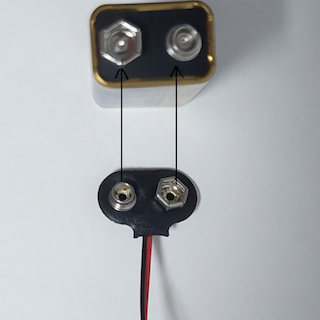
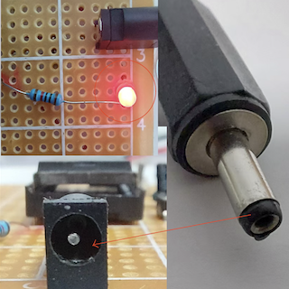

### 使用步骤

- 步骤1
  

###### 该装置为翻盖式设计，打开盖子即可进行接下来的操作。

- 步骤2

###### 按照图中的方式链接电源线与电池。

  
- 步骤3

###### 将电源线另一头的2mm直径插头插入唯一的端口。

- 步骤4

将一张任意的SIM卡按照图中的方向插入。随后合上翻盖，即可使用。

- 步骤5

此按钮是装置上唯一的按钮，当报警发生时，按下以停止报警，程序也随之重新开始。

---

##### 装置组成介绍图

---
#### 程序流程图
 
---

#### 反馈
想要反馈信息？或者想要预定产品？
###### 👉你可以通过邮箱联系我: Fall_detectemail@qq.com
---
#### 问卷调查链接（用于获得意见，进行创新及改善）
##### 感谢你的支持！

-问卷链接1: 关于设计初代跌倒检测报警装置
###### ➡️[点击填写问卷1](https://v.wjx.cn/vm/Q2Frjo2.aspx#)📝

-问卷链接2: 对于1代使用者的调查
###### 👉[点击填写问卷2](https://www.wjx.cn/vm/Q72F9Z0.aspx# )

---
[Homepage Link](esperaa.github.io/meaidevice/)

