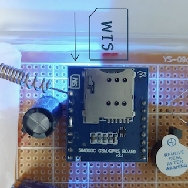

### 使用步骤

- 步骤1
  

- 步骤2

  
- 步骤3

- 步骤4

- 步骤5

---

##### 装置组成介绍

---

#### 反馈
想要反馈信息？或者想要预定产品？
###### 👉你可以通过邮箱联系我: Fall_detectemail@qq.com
---
#### 问卷调查链接（用于获得意见，进行创新及改善）
##### 感谢你的支持！

-问卷链接1: 关于设计初代跌倒检测报警装置
###### ➡️[点击填写问卷1](https://v.wjx.cn/vm/Q2Frjo2.aspx#)📝

-问卷链接2: 对于1代使用者的调查
###### 👉[点击填写问卷2](https://www.wjx.cn/vm/Q72F9Z0.aspx# )

---
[Homepage Link](esperaa.github.io/meaidevice/)

